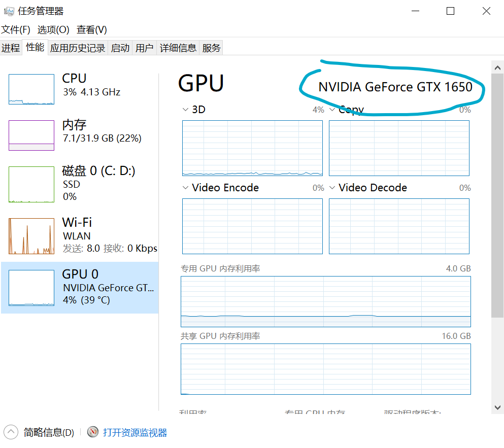

# PyTorch深度学习快速入门教程


## P1 PyTorch环境的配置及安装

### 1. anaconda安装

ANACONDA的历史版本下载：`https://repo.anaconda.com/archive/`

这边下载3.7对应的版本 `Anaconda3-2020.02-Windows-x86_64.exe`

### 2. 显卡

有无显卡对学习PyTorch并没有影响，显卡主要起到训练加速的作用。

关于显卡的配置，主要涉及：驱动 + `CUDA Toolkit`

* 驱动

  如下图，有看到GPU型号就表示驱动安装正常。

  

* `CUDA Toolkit` 可以跟随PyTorch一键安装

### 3. 有序的管理环境

不同的项目可能需要不同版本的环境，比如一个项目要用到pytorch 0.4，另一个项目要用到pytorch 1.0，如果你卸载了0.4版本，安装了1.0版本，那么下次，你再碰到0.4版本，就需要卸载1.0版本，安装0.4版本。很折腾。Anaconda集成的conda包就能够解决这个问题。它可以创建出两个屋子，相互隔离。一个屋子放0.4版本，一个屋子放1.0版本。你需要哪个版本，就进哪个屋子工作。

我们首先使用coda指令创建一个屋子，叫做pytorch

指令如下：

```cmd
conda create -n pytorch python=3.7
```

conda 是指调用 conda 包， create 是创建的意思， -n 是指后面的名字是屋子的名字，pytorch是屋子的名字（可以更改成自己喜欢的），python=3.6是指创建的屋子是python 3.6版本。

安装成功后提示：


使用`conda activate pytorch` 激活pytorch环境

使用`pip list` 查看环境中的包

 

### 4. pytorch的安装

`https://pytorch.org/`

`https://www.geforce.cn/hardware/technology/cuda/supported-gpus`


输入指令：`nvidia-smi`


注意：CUDA9.2 以上只支持驱动版本大于396.26的，如果版本小于它，可以通过电脑管家进行升级，或者进入英伟达的驱动程序下载界面`https://www.nvidia.com/Download/index.aspx?lang=cn`

安装pytorch


```cmd
conda install pytorch torchvision cudatoolkit=9.2 -c pytorch -c defaults -c numba/label/dev
```


<font color=red>（视频的这个安装命令有问题，使用下面的命令安装）</font>

```cmd
conda install pytorch torchvision torchaudio pytorch-cuda=11.7 -c pytorch -c nvidia
```

安装成功后，测试pytorch是否可以使用GPU

```cmd
python
>>> import torch
>>> torch.cuda.is_available()
# 如果返回的是True，则说明GPU可以正常使用
```

